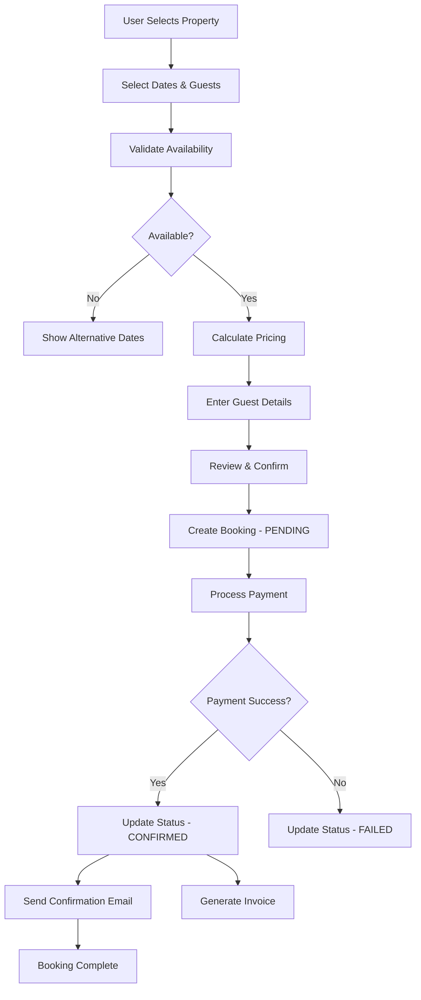
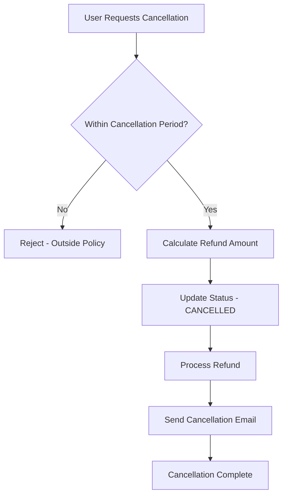

# Travel LyDian - Complete Booking System Documentation

## Table of Contents
1. [Overview](#overview)
2. [System Architecture](#system-architecture)
3. [API Endpoints](#api-endpoints)
4. [Booking Flow](#booking-flow)
5. [Database Models](#database-models)
6. [Services](#services)
7. [Error Codes](#error-codes)
8. [Testing](#testing)
9. [Integration Guide](#integration-guide)

---

## Overview

The Travel LyDian Booking System is a comprehensive, enterprise-grade solution for managing bookings across multiple travel categories:
- **Property Rentals** (Hotels, Villas, Apartments)
- **Car Rentals**
- **Airport Transfers**
- **Flights**

### Key Features
- Multi-category booking support
- Real-time availability checking
- Automated pricing calculation
- Payment integration (Stripe)
- Invoice generation (PDF)
- Email notifications
- Booking analytics
- Refund management
- Status tracking

---

## System Architecture

```
┌─────────────────────────────────────────────────────────┐
│                     Frontend Layer                       │
│  (Next.js Pages/Components with React Query)            │
└─────────────────┬───────────────────────────────────────┘
                  │
                  ▼
┌─────────────────────────────────────────────────────────┐
│                    API Routes Layer                      │
│  /api/bookings/property/*                               │
│  /api/bookings/car-rental/*                             │
│  /api/bookings/transfer/*                               │
│  /api/bookings/flight/*                                 │
└─────────────────┬───────────────────────────────────────┘
                  │
                  ▼
┌─────────────────────────────────────────────────────────┐
│                   Service Layer                          │
│  - BookingService                                        │
│  - NotificationService                                   │
│  - InvoiceGenerator                                      │
│  - AnalyticsService                                      │
└─────────────────┬───────────────────────────────────────┘
                  │
                  ▼
┌─────────────────────────────────────────────────────────┐
│                  Database Layer                          │
│  Prisma ORM → PostgreSQL                                │
│  - Booking                                               │
│  - RentalPropertyBooking                                │
│  - CarRentalBooking                                      │
│  - TransferBooking                                       │
└─────────────────────────────────────────────────────────┘
```

---

## API Endpoints

### Property Bookings

#### Create Property Booking
```http
POST /api/bookings/property/create
```

**Request Body:**
```json
{
  "propertyId": "clxxx...",
  "checkIn": "2025-06-15T00:00:00.000Z",
  "checkOut": "2025-06-20T00:00:00.000Z",
  "numberOfGuests": 2,
  "guestName": "John Doe",
  "guestPhone": "+90 555 123 4567",
  "guestEmail": "john@example.com",
  "specialRequests": "Late check-in",
  "paymentMethod": "CREDIT_CARD"
}
```

**Response:**
```json
{
  "success": true,
  "booking": {
    "id": "clxxx...",
    "bookingRef": "BK-A3H7K9",
    "status": "PENDING",
    "property": {...},
    "checkIn": "2025-06-15T00:00:00.000Z",
    "checkOut": "2025-06-20T00:00:00.000Z",
    "numberOfNights": 5,
    "numberOfGuests": 2,
    "pricing": {
      "nightlyRate": 150.00,
      "subtotal": 750.00,
      "cleaningFee": 50.00,
      "serviceFee": 37.50,
      "tax": 60.00,
      "totalPrice": 897.50,
      "currency": "TRY"
    }
  }
}
```

#### Get Property Booking
```http
GET /api/bookings/property/[id]
```

**URL Parameters:**
- `id`: Booking ID or Booking Reference (e.g., "BK-A3H7K9")

**Response:**
```json
{
  "success": true,
  "booking": {
    "id": "clxxx...",
    "bookingRef": "BK-A3H7K9",
    "status": "CONFIRMED",
    "property": {...},
    "checkIn": "2025-06-15T00:00:00.000Z",
    "checkOut": "2025-06-20T00:00:00.000Z",
    "numberOfNights": 5,
    "numberOfGuests": 2,
    "pricing": {...}
  }
}
```

#### Update Property Booking
```http
PUT /api/bookings/property/[id]/update
```

**Request Body:**
```json
{
  "specialRequests": "Updated requests"
}
```

#### Cancel Property Booking
```http
DELETE /api/bookings/property/[id]/cancel
POST /api/bookings/property/[id]/cancel
```

**Request Body:**
```json
{
  "reason": "Change of plans"
}
```

**Response:**
```json
{
  "success": true,
  "booking": {...},
  "refund": {
    "amount": 897.50,
    "percentage": 100,
    "message": "Full refund will be processed"
  }
}
```

---

### Car Rental Bookings

#### Create Car Rental Booking
```http
POST /api/bookings/car-rental/create
```

**Request Body:**
```json
{
  "carId": "clxxx...",
  "pickupLocation": "Antalya Airport",
  "dropoffLocation": "Antalya Airport",
  "pickupDate": "2025-06-15T00:00:00.000Z",
  "pickupTime": "10:00",
  "dropoffDate": "2025-06-20T00:00:00.000Z",
  "dropoffTime": "10:00",
  "driverName": "John Doe",
  "driverLicense": "ABC123456",
  "driverPhone": "+90 555 123 4567",
  "driverEmail": "john@example.com",
  "gpsRequested": true,
  "childSeatRequested": false,
  "additionalDriver": false,
  "specialRequests": "Airport pickup service",
  "paymentMethod": "CREDIT_CARD"
}
```

**Response:**
```json
{
  "success": true,
  "booking": {
    "id": "clxxx...",
    "bookingRef": "BK-X9K2M4",
    "status": "PENDING",
    "car": {...},
    "pickupLocation": "Antalya Airport",
    "dropoffLocation": "Antalya Airport",
    "pickupDate": "2025-06-15T00:00:00.000Z",
    "pickupTime": "10:00",
    "dropoffDate": "2025-06-20T00:00:00.000Z",
    "dropoffTime": "10:00",
    "numberOfDays": 5,
    "pricing": {
      "dailyRate": 200.00,
      "subtotal": 1000.00,
      "tax": 80.00,
      "deposit": 500.00,
      "extrasTotal": 250.00,
      "totalPrice": 1830.00,
      "currency": "TRY"
    },
    "extras": {
      "gps": true,
      "childSeat": false,
      "additionalDriver": false
    }
  }
}
```

#### Get Car Rental Booking
```http
GET /api/bookings/car-rental/[id]
```

#### Update Car Rental Booking
```http
PUT /api/bookings/car-rental/[id]/update
```

#### Cancel Car Rental Booking
```http
DELETE /api/bookings/car-rental/[id]/cancel
POST /api/bookings/car-rental/[id]/cancel
```

---

### Transfer Bookings

#### Create Transfer Booking
```http
POST /api/bookings/transfer/create
```

**Request Body:**
```json
{
  "transferId": "clxxx...",
  "vehicleId": "clxxx...",
  "transferType": "ONE_WAY",
  "pickupLocation": "Antalya Airport",
  "dropoffLocation": "Lara Beach Hotel",
  "pickupDate": "2025-06-15T00:00:00.000Z",
  "pickupTime": "14:30",
  "passengerCount": 4,
  "luggageCount": 4,
  "flightNumber": "TK1234",
  "arrivalTime": "14:00",
  "isVIP": false,
  "specialRequests": "Child seat required",
  "paymentMethod": "CREDIT_CARD"
}
```

**Response:**
```json
{
  "success": true,
  "booking": {
    "id": "clxxx...",
    "bookingRef": "BK-T5N8P2",
    "status": "PENDING",
    "transfer": {...},
    "vehicle": {...},
    "transferType": "ONE_WAY",
    "pickupLocation": "Antalya Airport",
    "dropoffLocation": "Lara Beach Hotel",
    "pickupDate": "2025-06-15T00:00:00.000Z",
    "pickupTime": "14:30",
    "passengerCount": 4,
    "luggageCount": 4,
    "flightNumber": "TK1234",
    "arrivalTime": "14:00",
    "pricing": {
      "basePrice": 150.00,
      "totalPrice": 150.00,
      "currency": "TRY",
      "isVIP": false
    }
  }
}
```

#### Get Transfer Booking
```http
GET /api/bookings/transfer/[id]
```

#### Update Transfer Booking
```http
PUT /api/bookings/transfer/[id]/update
```

#### Cancel Transfer Booking
```http
DELETE /api/bookings/transfer/[id]/cancel
POST /api/bookings/transfer/[id]/cancel
```

---

### Flight Bookings

#### Create Flight Booking
```http
POST /api/bookings/flight/create
```

**Request Body:**
```json
{
  "flightId": "clxxx...",
  "passengers": [
    {
      "type": "adult",
      "firstName": "John",
      "lastName": "Doe",
      "dateOfBirth": "1990-01-01",
      "passportNumber": "AB123456"
    }
  ],
  "contactInfo": {
    "email": "john@example.com",
    "phone": "+90 555 123 4567"
  },
  "baggageOptions": {
    "extraBaggage": 1
  },
  "seatPreferences": "Window seat",
  "specialRequests": "Vegetarian meal",
  "paymentMethod": "CREDIT_CARD"
}
```

**Response:**
```json
{
  "success": true,
  "booking": {
    "id": "clxxx...",
    "bookingRef": "BK-F7L4N9",
    "status": "PENDING",
    "flight": {
      "flightNumber": "TK1234",
      "airline": "Turkish Airlines",
      "departureAirport": "IST",
      "arrivalAirport": "AYT",
      "departureTime": "2025-06-15T10:00:00.000Z",
      "arrivalTime": "2025-06-15T11:30:00.000Z",
      "duration": 90,
      "cabinClass": "ECONOMY"
    },
    "passengers": {
      "adults": 1,
      "children": 0,
      "infants": 0
    },
    "pricing": {
      "subtotal": 500.00,
      "baggageFee": 50.00,
      "totalPrice": 550.00,
      "currency": "TRY"
    }
  }
}
```

#### Get Flight Booking
```http
GET /api/bookings/flight/[id]
```

---

## Booking Flow

### 1. Property Booking Flow



### 2. Cancellation Flow



---

## Database Models

### Booking (Main)
```prisma
model Booking {
  id              String      @id @default(cuid())
  userId          String
  bookingType     BookingType
  status          BookingStatus @default(PENDING)
  totalAmount     Decimal
  currency        String      @default("TRY")
  paymentMethod   PaymentMethod
  paymentStatus   PaymentStatus @default(PENDING)
  bookingReference String     @unique
  metaData        Json?
  createdAt       DateTime    @default(now())
  updatedAt       DateTime    @updatedAt

  user            User        @relation(fields: [userId], references: [id])
}
```

### RentalPropertyBooking
```prisma
model RentalPropertyBooking {
  id              String          @id @default(cuid())
  userId          String
  propertyId      String
  bookingRef      String          @unique
  checkIn         DateTime
  checkOut        DateTime
  numberOfNights  Int
  numberOfGuests  Int
  nightlyRate     Decimal
  subtotal        Decimal
  cleaningFee     Decimal         @default(0)
  serviceFee      Decimal         @default(0)
  tax             Decimal         @default(0)
  totalPrice      Decimal
  currency        String          @default("TRY")
  status          BookingStatus   @default(PENDING)
  paymentStatus   PaymentStatus   @default(PENDING)
  paymentMethod   PaymentMethod?
  createdAt       DateTime        @default(now())
  updatedAt       DateTime        @updatedAt

  property        RentalProperty  @relation(fields: [propertyId], references: [id])
}
```

### CarRentalBooking
```prisma
model CarRentalBooking {
  id              String          @id @default(cuid())
  userId          String
  carId           String
  bookingRef      String          @unique
  pickupLocation  String
  dropoffLocation String
  pickupDate      DateTime
  pickupTime      String
  dropoffDate     DateTime
  dropoffTime     String
  dailyRate       Decimal
  numberOfDays    Int
  subtotal        Decimal
  tax             Decimal         @default(0)
  deposit         Decimal         @default(0)
  totalPrice      Decimal
  currency        String          @default("TRY")
  gpsRequested    Boolean         @default(false)
  childSeatRequested Boolean      @default(false)
  additionalDriver Boolean        @default(false)
  extrasTotal     Decimal         @default(0)
  status          BookingStatus   @default(PENDING)
  paymentStatus   PaymentStatus   @default(PENDING)

  car             CarRental       @relation(fields: [carId], references: [id])
}
```

### TransferBooking
```prisma
model TransferBooking {
  id              String          @id @default(cuid())
  userId          String
  transferId      String
  vehicleId       String
  bookingRef      String          @unique
  transferType    TransferType    @default(ONE_WAY)
  pickupLocation  String
  dropoffLocation String
  pickupDate      DateTime
  pickupTime      String
  returnDate      DateTime?
  returnTime      String?
  passengerCount  Int
  luggageCount    Int
  flightNumber    String?
  arrivalTime     String?
  basePrice       Decimal
  totalPrice      Decimal
  currency        String          @default("TRY")
  isVIP           Boolean         @default(false)
  status          BookingStatus   @default(PENDING)
  paymentStatus   PaymentStatus   @default(PENDING)

  transfer        AirportTransfer @relation(fields: [transferId], references: [id])
  vehicle         TransferVehicle @relation(fields: [vehicleId], references: [id])
}
```

---

## Services

### BookingService
Location: `/src/lib/services/booking-service.ts`

**Methods:**
- `createBooking(input)` - Create a new booking
- `getBookingById(id, userId?)` - Get booking by ID
- `getBookingByReference(reference)` - Get booking by reference
- `updateBooking(id, input, userId?)` - Update booking
- `cancelBooking(id, userId?, reason?)` - Cancel booking
- `getUserBookings(userId, filters?)` - Get user's bookings
- `confirmPayment(id, paymentIntentId?)` - Confirm payment
- `completeBooking(id)` - Mark booking as completed
- `getBookingStats(userId?)` - Get booking statistics

### InvoiceGenerator
Location: `/src/lib/invoice/generator.ts`

**Methods:**
- `generateInvoice(data)` - Generate PDF invoice
- `downloadInvoice(data, filename?)` - Download invoice
- `getInvoiceBase64(data)` - Get invoice as base64 string

### NotificationService
Location: `/src/lib/notifications/booking-notifications.ts`

**Methods:**
- `sendBookingConfirmation(data)` - Send booking confirmation email
- `sendBookingReminder(data)` - Send 24h reminder email
- `sendCancellationConfirmation(data)` - Send cancellation email
- `sendPaymentConfirmation(data)` - Send payment confirmation email

### AnalyticsService
Location: `/src/lib/analytics/booking-analytics.ts`

**Methods:**
- `getBookingAnalytics(filters?)` - Get comprehensive analytics
- `getRevenueByDateRange(startDate, endDate, groupBy)` - Get revenue trends
- `getBookingFunnel(startDate?, endDate?)` - Get conversion funnel
- `getTopCustomers(limit)` - Get top customers

---

## Error Codes

| Code | Message | Description |
|------|---------|-------------|
| 400 | Missing required fields | Required parameters not provided |
| 400 | Invalid booking dates | Dates validation failed |
| 400 | Property is not available | Property not active |
| 401 | Unauthorized | Authentication required |
| 403 | Access denied | User doesn't own the booking |
| 404 | User not found | User account not found |
| 404 | Property not found | Property doesn't exist |
| 404 | Booking not found | Booking doesn't exist |
| 409 | Property not available for selected dates | Conflicting bookings exist |
| 500 | Internal server error | Server-side error |

---

## Testing

### Test Booking Creation
```bash
curl -X POST http://localhost:3100/api/bookings/property/create \
  -H "Content-Type: application/json" \
  -H "Authorization: Bearer YOUR_TOKEN" \
  -d '{
    "propertyId": "clxxx...",
    "checkIn": "2025-06-15T00:00:00.000Z",
    "checkOut": "2025-06-20T00:00:00.000Z",
    "numberOfGuests": 2,
    "guestName": "Test User",
    "guestEmail": "test@example.com"
  }'
```

### Test Invoice Generation
```typescript
import { generateInvoice, downloadInvoice } from '@/lib/invoice/generator'

const invoiceData = {
  companyName: 'Travel LyDian',
  companyAddress: 'Istanbul, Turkey',
  companyPhone: '+90 555 123 4567',
  companyEmail: 'support@travel.lydian.com',
  companyWebsite: 'https://travel.lydian.com',
  invoiceNumber: 'INV-2025-001',
  invoiceDate: new Date(),
  bookingReference: 'BK-A3H7K9',
  customerName: 'John Doe',
  customerEmail: 'john@example.com',
  bookingType: 'property',
  items: [
    {
      description: 'Villa Rental - 5 nights',
      quantity: 5,
      unitPrice: 150,
      total: 750
    }
  ],
  subtotal: 750,
  tax: 60,
  serviceFee: 37.50,
  cleaningFee: 50,
  totalAmount: 897.50,
  currency: 'TRY',
  paymentMethod: 'Credit Card',
  paymentStatus: 'COMPLETED'
}

// Generate and download
downloadInvoice(invoiceData, 'invoice.pdf')
```

---

## Integration Guide

### Frontend Integration Example

```typescript
import { useState } from 'react'
import { useMutation } from '@tanstack/react-query'

export function PropertyBookingForm({ propertyId }) {
  const [formData, setFormData] = useState({
    checkIn: '',
    checkOut: '',
    numberOfGuests: 2,
    guestName: '',
    guestEmail: '',
    guestPhone: '',
  })

  const bookingMutation = useMutation({
    mutationFn: async (data) => {
      const response = await fetch('/api/bookings/property/create', {
        method: 'POST',
        headers: { 'Content-Type': 'application/json' },
        body: JSON.stringify({ ...data, propertyId }),
      })
      return response.json()
    },
    onSuccess: (data) => {
      console.log('Booking created:', data.booking)
      // Redirect to booking confirmation page
      window.location.href = `/bookings/${data.booking.bookingRef}`
    },
    onError: (error) => {
      console.error('Booking failed:', error)
    },
  })

  const handleSubmit = (e) => {
    e.preventDefault()
    bookingMutation.mutate(formData)
  }

  return (
    <form onSubmit={handleSubmit}>
      {/* Form fields */}
      <button type="submit" disabled={bookingMutation.isLoading}>
        {bookingMutation.isLoading ? 'Creating...' : 'Book Now'}
      </button>
    </form>
  )
}
```

---

## Summary

The Travel LyDian Booking System provides:

- **12 API Endpoints** for complete booking management
- **4 Booking Types** (Property, Car, Transfer, Flight)
- **Automated Processing** with email notifications and invoice generation
- **Analytics Dashboard** for business insights
- **Refund Management** with flexible cancellation policies
- **Enterprise-Grade** error handling and validation

For support or questions, contact: support@travel.lydian.com

---

**Version:** 1.0.0
**Last Updated:** December 28, 2025
**Author:** Travel LyDian Development Team
